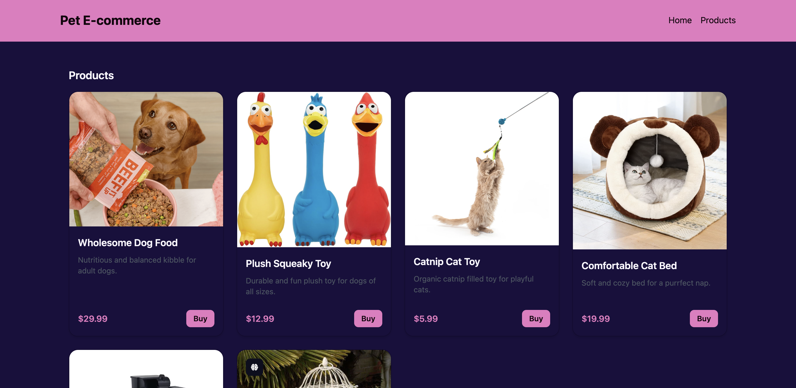

# 🐾 Pet Store

An e-commerce platform for pet products built with Angular (frontend) and Node.js + Prisma (backend). Supports product browsing, GraphQL APIs, and admin management.





---

## 🚀 Getting Started

### 🧾 Clone the Project

```bash
git clone https://github.com/leejlaa/pet-store.git
cd pet-store

cd apps/pet-markt-web
npm install

npx prisma generate
npx prisma migrate dev --name init
npx prisma db seed


cd apps/pet-markt-be
nx serve pet-markt-be

cd apps/pet-markt-web
nx serve pet-markt-web

🛠️ Tech Stack

Frontend: Angular 17, Tailwind CSS, DaisyUI

Backend: Node.js, Prisma ORM, GraphQL (Apollo)

Database: PostgreSQL

Tools: Nx (optional), npm, Prisma Studio
